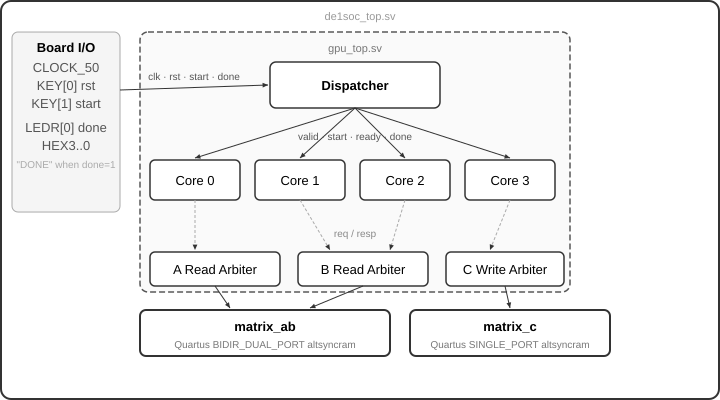
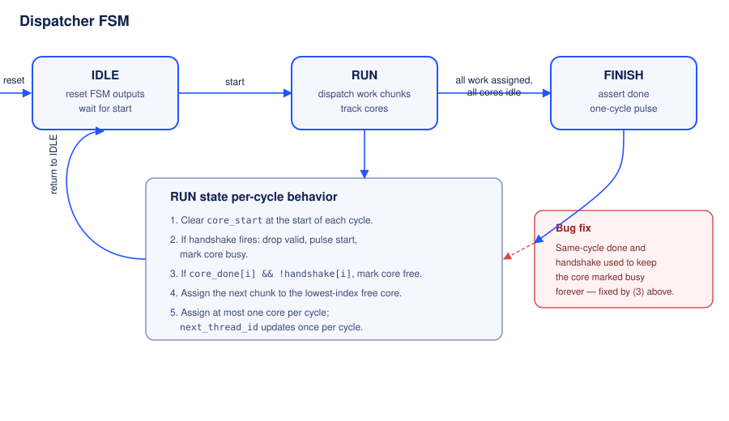
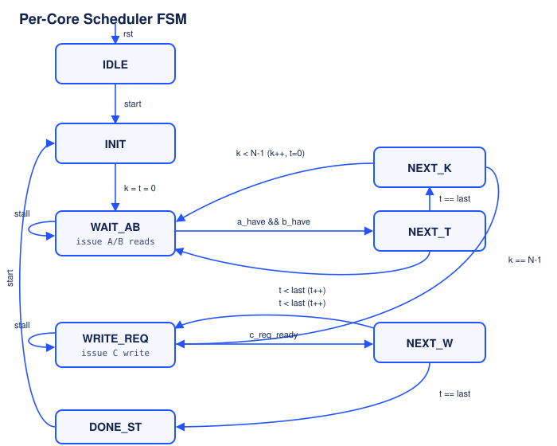
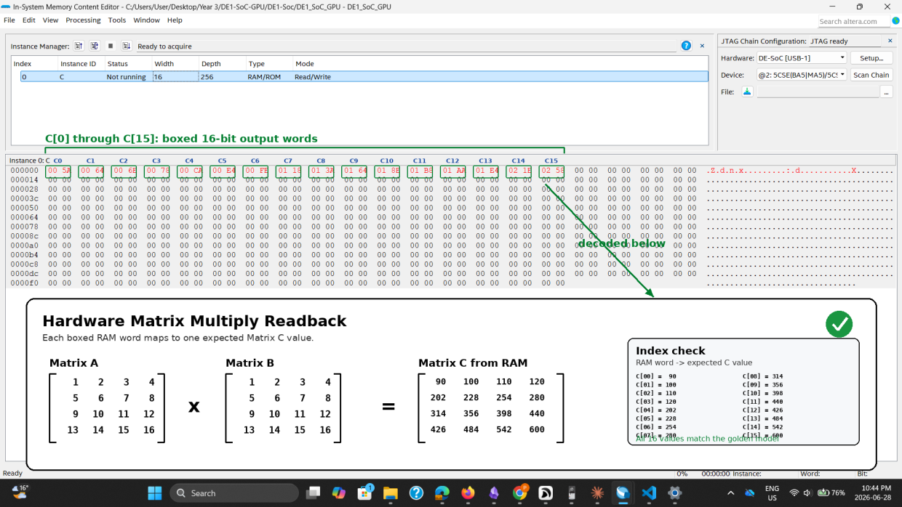

# SIMT Matrix Multiply Accel

A fixed-function SIMT accelerator written in SystemVerilog, targeting the Terasic DE1-SoC (Cyclone V). Computes parameterised N×N integer matrix multiplication across multiple hardware cores using a shared-memory arbitration model.

This is the first milestone toward a full SIMT GPU — it doesn't have an ISA yet, so it's a fixed-function accelerator, not a programmable GPU.

No vendor IP — all RTL hand-written and verified in ModelSim ASE.

**`NUM_CORES = 4` · `THREADS_PER_CORE = 2` · `N = 4` (parameterised)**

---

## Table of Contents

- [Architecture](#architecture)
- [Dispatcher](#dispatcher)
- [Scheduler](#scheduler)
- [Arbiters](#arbiters)
- [Hardware Verification](#hardware-verification)

---

## Architecture

All four cores share one physical read port per input matrix and one write port for the output matrix, each guarded by a round-robin arbiter. Cores that lose arbitration stall and re-request next cycle — contention is instrumented, not hidden.

The two Quartus memory IPs (`matrix_ab`, `matrix_c`) are instantiated outside `gpu_top` in the board wrapper `de1soc_top.sv`, keeping the accelerator logic vendor-agnostic.

---

## Dispatcher

`dispatcher.sv` manages a pool of cores with a 3-state FSM. The interesting challenge is avoiding races during re-dispatch.

**Design choices worth noting:**

- **Same-cycle done/start guard.** When a core finishes and the dispatcher immediately reassigns it, `core_done[i]` is still high for exactly one cycle while `core_start[i]` has been pulsed but hasn't arrived yet. Without a guard, the dispatcher's completion-handler would see `done=1` and clear the busy bit it just set, handing the core a third block on top of a still-running one. The fix: `if (core_done[i] && !handshake[i])` — a core being handshaked this cycle is exempt from the completion scan.

- **One handshake per cycle.** `next_thread_id` advances once per cycle, preventing two blocks being dispatched to different cores in a single clock edge.

- **Sticky done.** `done` in `scheduler.sv` is `assign done = done_r && !start` — combinationally forced low the instant `start` arrives, so the dispatcher can never see a stale `done=1` on the same cycle it sends `start`.

---

## Scheduler

`scheduler.sv` is the 8-state kernel FSM inside each core. It drives the inner-product loop `k = 0..N-1` across `t = 0..THREADS_PER_CORE-1` threads.

**Design choices worth noting:**

- **Independent A and B requests.** The two read arbiters are fully independent — a core can win the A arbiter one cycle and the B arbiter a different cycle. The scheduler tracks `a_inflight` and `b_inflight` to avoid re-asserting a request that has already been granted but whose data hasn't arrived yet, and only pulses `fma_en[t]` once both `a_have` and `b_have` are set.

- **Stall on contention.** `WAIT_AB` and `WRITE_REQ` re-assert their request every cycle until `req_ready` is received. The scheduler never drops a request mid-flight.

- **A/B response latches in `core.sv`.** BRAM read data is only valid for one cycle on the shared port. The latches in `core.sv` capture `resp_data` on `resp_valid` and hold it stable until `fma_en[t]` fires — necessary because the two operands can arrive on different cycles.

---

## Arbiters

`rr_read_arbiter.sv` and `rr_write_arbiter.sv` implement the same round-robin policy. The most interesting design point is latency handling.

**Grant is combinational.** `req_ready` (the grant signal) is driven the same cycle as `req_valid`. The winning core's address hits the BRAM that same cycle.

**Parameterised response pipeline.** After a grant, `resp_valid` fires `BRAM_LATENCY` cycles later — implemented as a shift register `grant_pipe[BRAM_LATENCY]`. This single parameter bridges a real hardware/simulation mismatch:

| Target | `BRAM_LATENCY` | Why |
|---|---|---|
| `dual_port_bram` (simulation) | `1` | Registered output, combinational address |
| `matrix_ab` altsyncram IP (hardware) | `2` | Registered address **and** registered output |

`de1soc_top` overrides to `BRAM_READ_LATENCY=2`. Without this, every core read one grant early, producing a systematic corruption across all of matrix C — visible on hardware but invisible in simulation until a hardware-accurate testbench was written.

---

## Hardware Verification

Beyond simulation, the design was verified against a golden model directly on
the DE1-SoC using the Quartus In-System Memory Content Editor to read back
`matrix_c` live from BRAM:

Each boxed RAM word maps to one expected `C` value from the 4&times;4
matrix multiply; all 16 values matched.
