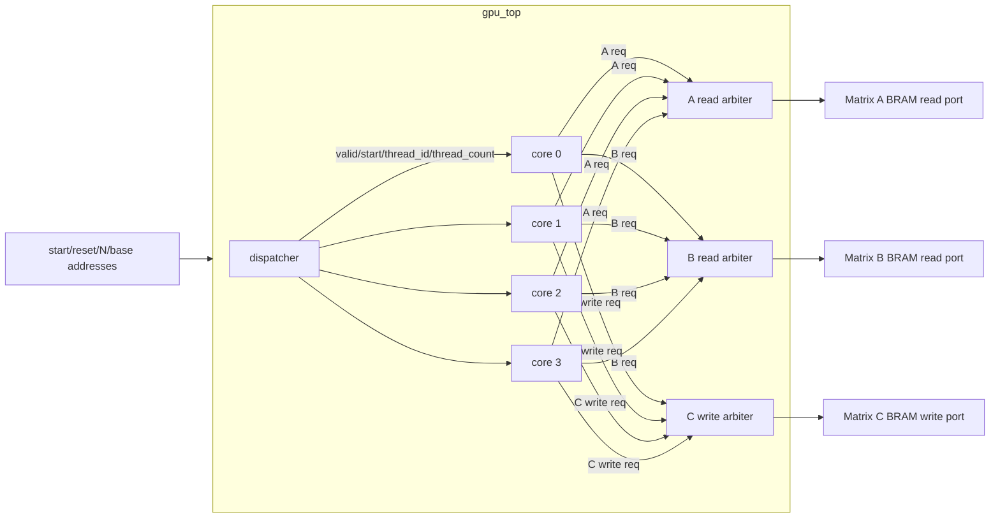
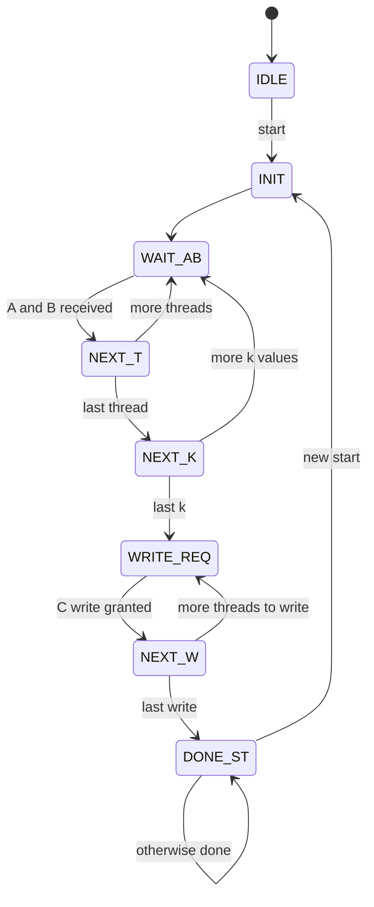
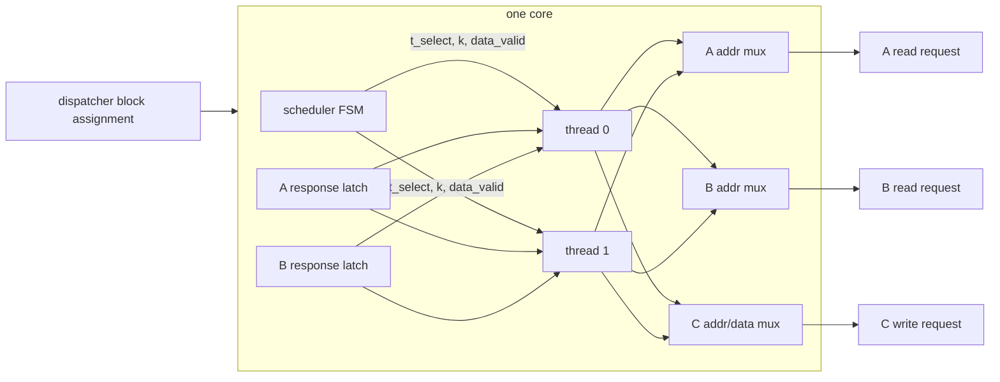
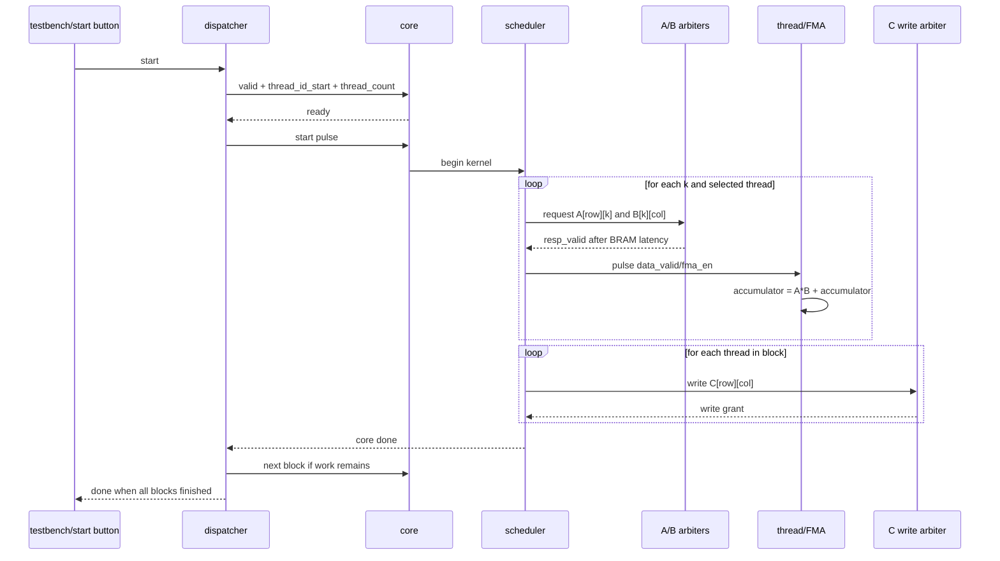

# DE1-SoC GPU Walkthrough

This document is a study guide for explaining the project. The short version:
this is a small SIMT-style matrix-multiply GPU. A dispatcher splits the output
matrix `C` into blocks, cores compute those blocks, and shared round-robin
arbiters let all cores access the A, B, and C memories through one port each.

## Source Of Truth

- Current RTL lives in `rtl/`.
- Current top-level simulation testbench is `tb/Top/gpu_top_tb.sv`.
- Hardware wrapper is `rtl/de1soc_top.sv`.
- `src/` and `src/tb/Top/rtl/` contain older or duplicated material. Treat them
  as reference unless a run script explicitly uses them.

## Big Picture



The important design idea is contention. Four cores do not each get their own
memory ports. Instead, all cores share:

- one A read port,
- one B read port,
- one C write port.

The arbiters choose one requesting core per cycle. A core that loses arbitration
keeps its request asserted and stalls.

## Matrix Multiply Mapping

The project computes:

```text
C[row][col] = sum over k of A[row][k] * B[k][col]
```

Each output element is called a "thread" in this project.

For `N = 4`, there are `N*N = 16` output elements:

```text
thread_id 0  -> C[0][0]
thread_id 1  -> C[0][1]
thread_id 2  -> C[0][2]
thread_id 3  -> C[0][3]
thread_id 4  -> C[1][0]
...
thread_id 15 -> C[3][3]
```

With `THREADS_PER_CORE = 2`, each dispatched block contains two output elements.
With `NUM_CORES = 4`, the 16 outputs become 8 blocks, so each core gets reused.

## Module Roles

### `rtl/de1soc_top.sv`

Board wrapper. It connects the FPGA board pins to the GPU.

- `CLOCK_50` becomes the GPU clock.
- `KEY[0]` is active-low reset.
- `KEY[1]` is active-low start.
- `LEDR[0]` shows done.
- HEX displays latch `C[0][0]`.
- Instantiates real Quartus memory IPs: `matrix_ab` and `matrix_c`.
- Overrides `BRAM_READ_LATENCY` to `2`, because the real memory IP has a
  two-cycle read latency.

### `rtl/gpu_top.sv`

Main system integration module.

- Instantiates one dispatcher.
- Instantiates `NUM_CORES` cores.
- Instantiates two read arbiters: one for A, one for B.
- Instantiates one write arbiter for C.
- Exposes debug counters for grants and stalls.

### `rtl/dispatcher.sv`

Work distributor. It does not compute matrix values. It only decides which core
gets which output-element block.

Its handshake with each core is:

```text
core_valid: dispatcher has a block ready
core_ready: core is idle
core_start: one-cycle pulse that actually begins the block
```

It gives work to the lowest-index free core and tracks:

- `next_thread_id`: first unassigned output element,
- `threads_remaining`: how much work is left,
- `core_busy`: which cores are currently running.

### `rtl/core.sv`

One compute core. It contains:

- one scheduler,
- `THREADS_PER_CORE` thread instances,
- A/B response latches,
- muxes that select the active thread's A/B/C addresses.

The core is the bridge between "block of output elements" and "memory
transactions."

### `rtl/scheduler.sv`

The core's control FSM. It decides when to:

- request A and B values,
- wait until both operands return,
- pulse `data_valid`/`fma_en` for the selected thread,
- move to the next thread,
- move to the next `k`,
- request writes to C,
- assert `done`.

Current FSM shape:



### `rtl/thread.sv`

One output element calculator.

Given `thread_id`, it computes:

```text
row = thread_id / N
col = thread_id % N
addr_A = base_addr_A + row*N + k
addr_B = base_addr_B + k*N + col
addr_C = base_addr_C + row*N + col
```

When `data_valid` pulses, it feeds `a_val`, `b_val`, and the current accumulator
into the FMA. Across all `k` values, the accumulator becomes the final C value.

### `rtl/fma.sv`

One-cycle multiply-add:

```text
result = low DATA_WIDTH bits of (a*b) + c
```

It also delays `valid_in` into `valid_out`.

### `rtl/rr_read_arbiter.sv`

Round-robin read arbiter. Many cores request one BRAM read port.

Per core:

```text
req_valid: I want to read this address
req_ready: you got the port this cycle
resp_valid: your data is valid after BRAM_LATENCY cycles
resp_data: returned memory data
```

This module is where the simulation-vs-hardware memory latency difference is
handled.

### `rtl/rr_write_arbiter.sv`

Round-robin write arbiter. Many cores request one BRAM write port.

Writes are simpler than reads:

```text
req_valid + req_ready in the same cycle means the write committed
```

### `rtl/dual_port_bram.sv`

Simulation-friendly BRAM model used by `gpu_top_tb.sv`.

It has a one-cycle read latency. The real hardware IP used by `de1soc_top.sv`
has a two-cycle latency for A/B, which is why `de1soc_top` sets
`BRAM_READ_LATENCY = 2`.

## One Core Internals



## End-To-End Execution Timeline



## Testbench Guide

| Testbench | DUT | What it checks | Current trust level |
|---|---|---|---|
| `tb/fma/fma_tb.sv` | `fma` | Directed multiply-add cases and valid timing. | Useful and current. |
| `tb/thread/thread_tb.sv` | `thread` | Address generation and accumulated result for several `thread_id`/`N` cases. | Mostly useful, but it does not drive `kernel_init`, so it misses the reused-thread reset behavior. |
| `tb/dispatcher/dispatcher_tb.sv` | `dispatcher` | Fake cores receive blocks in order, pulse done later, and all threads are assigned. | Useful and current for dispatch behavior. |
| `tb/scheduler/scheduler_tb.sv` | `scheduler` | Intended to check scheduler sequencing. | Stale/broken against current `scheduler.sv` ports. Needs rewrite for `a_req_*`, `b_req_*`, and `c_req_*`. |
| `tb/core/Core_tb.sv` | `core` | Intended to check one core against memory IPs. | Stale/broken against current `core.sv` ports. Uses old direct memory interface. |
| `src/tb/MemController/mem_controller_tb.sv` | `mem_controller` | Old combined read/write controller fairness and basic memory operations. | Reference only. `mem_controller.sv` is not the current `gpu_top` memory path. |
| `tb/Top/gpu_top_tb.sv` | `gpu_top` | Full 4x4 matrix multiply, shared arbiters, golden C matrix, write count, stall/grant counters. | Main current system test. |
| `tb/Top/de1soc_top_tb.sv` | `de1soc_top` | Full 4x4 matrix multiply through real Quartus `matrix_ab`/`matrix_c` IPs. | Main hardware-accurate test. |

## How To Read A Testbench

For each testbench, ask five questions:

1. What is the DUT?
2. What fake world does the testbench build around it?
3. What stimulus starts the DUT?
4. What does the testbench monitor while the DUT runs?
5. What exact condition makes it pass or fail?

Example for `gpu_top_tb.sv`:

- DUT: `gpu_top`.
- Fake world: three `dual_port_bram` memories for A, B, C.
- Stimulus: reset, set `N=4`, preload A/B, pulse `start`.
- Monitor: every C write and final `done`.
- Pass/fail: every C memory word matches the software golden model, exactly
  16 writes happened, and no timeout occurred.

## Diagrams To Make For A Report Or Presentation

Use these diagrams:

1. System architecture: `dispatcher -> cores -> arbiters -> BRAMs`.
2. Per-core architecture: `scheduler -> threads/FMA -> memory request muxes`.
3. Scheduler FSM: `IDLE -> INIT -> WAIT_AB -> ... -> DONE_ST`.
4. Testbench architecture: `testbench stimulus -> DUT -> fake memories -> golden checker`.
5. Hardware vs simulation memory diagram:
   - simulation: separate A, B, C `dual_port_bram` models, read latency 1;
   - hardware: real `matrix_ab`/`matrix_c` IPs, A/B read latency 2.

## Things To Be Careful Explaining

- A "thread" here is hardware for one output element, not a software thread.
- A "core" contains multiple thread units and one scheduler.
- The dispatcher assigns output elements, not instructions.
- The scheduler is hardcoded for matrix multiply. This is not a programmable GPU yet.
- The current memory design is intentionally bandwidth-limited: stalls are expected.
- `gpu_top_tb` passing proves the current RTL works with the simulation BRAM model.
- `de1soc_top_tb` passing proves the board wrapper works with the real Quartus memory IP timing.
- `scheduler_tb` and `Core_tb` should not be used as proof of the current v2 interfaces until rewritten.
